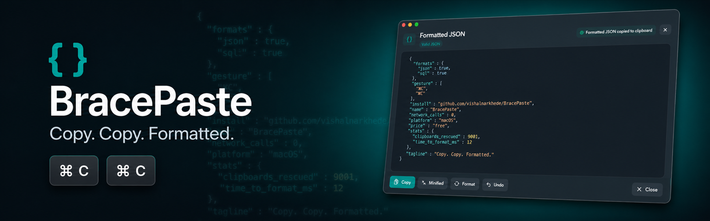

<div align="center">



# BracePaste

A native macOS menu bar app that formats JSON — and SQL — from your clipboard
with a double **⌘C** gesture.

[](https://github.com/vishalnarkhede/BracePaste/releases/latest)
[](#requirements)
[](LICENSE)

All processing is local. No network. No clipboard history.

</div>

---

## How it works

1. Select JSON (or JSON-ish text, or a SQL query) in **any** app.
2. Press **⌘C twice** within ~2 seconds (interval is configurable).
3. The clipboard is replaced with the formatted result and a floating editor pops up.
4. If the text isn't recognizable, nothing happens — an ordinary double-copy stays quiet.

You can also format on demand via **Format Clipboard** in the `{ }` menu bar icon,
or with an optional global keyboard shortcut.

## Install

1. Download the latest **`.dmg`** from [Releases](https://github.com/vishalnarkhede/BracePaste/releases/latest).
2. Open the DMG and drag **BracePaste** into **Applications**.
3. Launch it from Applications (or Spotlight). Look for the `{ }` icon in the menu bar.

### First launch (Gatekeeper)

The release build is ad-hoc signed (no paid Apple Developer ID), so macOS will warn on first open:

1. In **Applications**, **right-click** `BracePaste.app` → **Open** → **Open**.
2. If macOS blocks it anyway: open **System Settings → Privacy & Security**, scroll to the
   *"BracePaste was blocked…"* message, and click **Open Anyway**.

This is only needed once per installed version.

## Granting Accessibility permission

BracePaste watches for the double-⌘C keystroke with a system event tap, which requires the
**Accessibility** permission.

> **No permission? It still works.** Without Accessibility, BracePaste automatically falls back
> to watching clipboard *changes* instead of keystrokes — double-⌘C still triggers, just slightly
> less instantly. The menu bar **Format Clipboard** action always works. Granting Accessibility
> gives you the fastest, most reliable trigger.

### Via the prompt (easiest)

On first launch BracePaste asks for the permission:

1. Click **Request Access** in the onboarding window (or in **Settings → Permissions**).
2. macOS shows a system dialog → click **Open System Settings**.
3. Toggle **BracePaste** **on** in the list.
4. Switch back to BracePaste — the status updates automatically.

### Manually

1. Open **System Settings → Privacy & Security → Accessibility**.
2. Find **BracePaste** in the list and switch it **on**.
3. If BracePaste isn't listed: click the **+** button (unlock with Touch ID/password first),
   pick `BracePaste.app` from **Applications**, then make sure its toggle is on.

### After updating to a new version ⚠️

Each release is signed with a fresh ad-hoc signature, so macOS may treat the updated app as a
*different* program. Symptom: the toggle in Accessibility **looks enabled, but double-⌘C stopped
working**. Fix:

1. **System Settings → Privacy & Security → Accessibility**.
2. Select **BracePaste**, remove it with the **–** button.
3. Re-add it with **+** (choose `/Applications/BracePaste.app`) and toggle it on.
4. Quit BracePaste (menu bar `{ }` → Quit) and relaunch it.

## What it formats

### JSON

- Strict JSON objects and arrays — no Python dicts, JS object literals, or trailing commas
- Extracted from wherever it hides, in priority order:
  1. ```` ```json ```` code fences
  2. the exact clipboard contents (including escaped `"{\"a\":1}"` strings)
  3. other code fences
  4. JSON embedded in surrounding text (log lines, chat output) — the noise is stripped
- Repairs soft-wrapped strings that chat UIs break across lines

### SQL *(new in 1.2.0)*

A copied SQL statement is formatted **whole** instead of being stripped down to any JSON inside it:

```sql
SELECT id,
  name
FROM core_site
WHERE organization_id = '12345'
  AND config @> '{
    "moderation" : {
      "enabled" : true
    }
  }'::jsonb
LIMIT 50;
```

- Keywords uppercased, clauses on their own lines, `AND`/`OR` indented
- JSON literals inside quoted strings are pretty-printed **in place** (escaping preserved)
- Detection is conservative — an English sentence that happens to start with "Select" is left alone
- **Minified** copies the statement back as a single line

## Features

- Double-⌘C system-wide trigger (non-consuming — your normal copy is untouched)
- Syntax-highlighted floating editor with **Copy**, **Copy Minified**, **Format Again**
- Safe clipboard **Undo** — restores exactly what you copied, but only if you haven't copied
  anything else since
- Optional global shortcut, 2-space / 4-space / tab indentation, open at login, Dock icon toggle
- Auto-replace clipboard on success (optional)

## Troubleshooting

| Symptom | Fix |
|---|---|
| Double-⌘C does nothing | Check the `{ }` menu is in the menu bar; check **Settings → Permissions** shows *Granted* |
| Stopped working after an update | Re-grant Accessibility — see [After updating](#after-updating-to-a-new-version-️) |
| "App is damaged / can't be opened" | Right-click → Open, or **Privacy & Security → Open Anyway** |
| Trigger feels slow | Grant Accessibility — without it the fallback polls the clipboard |
| Valid-looking JSON rejected | BracePaste is strict: no single quotes, no trailing commas, no comments |

## Requirements

- macOS 13.0 (Ventura) or later

## Build from source

```bash
brew install xcodegen   # if needed
git clone https://github.com/vishalnarkhede/BracePaste.git
cd BracePaste
xcodegen generate
xcodebuild -scheme JSONClipboardFormatter -configuration Release -destination 'platform=macOS' build
```

Or open the generated Xcode project. Run the tests with:

```bash
xcodebuild -scheme JSONClipboardFormatter -destination 'platform=macOS' \
  -only-testing:JSONClipboardFormatterTests test
```

### Create a DMG locally

```bash
./scripts/build-dmg.sh <version>
```

Output: `dist/BracePaste-<version>.dmg`

## Privacy

- Clipboard content **never leaves your Mac** — there is no networking code at all
- No analytics or telemetry
- Only the latest result + one undo snapshot are kept in memory, cleared on quit

## License

[MIT](LICENSE)
